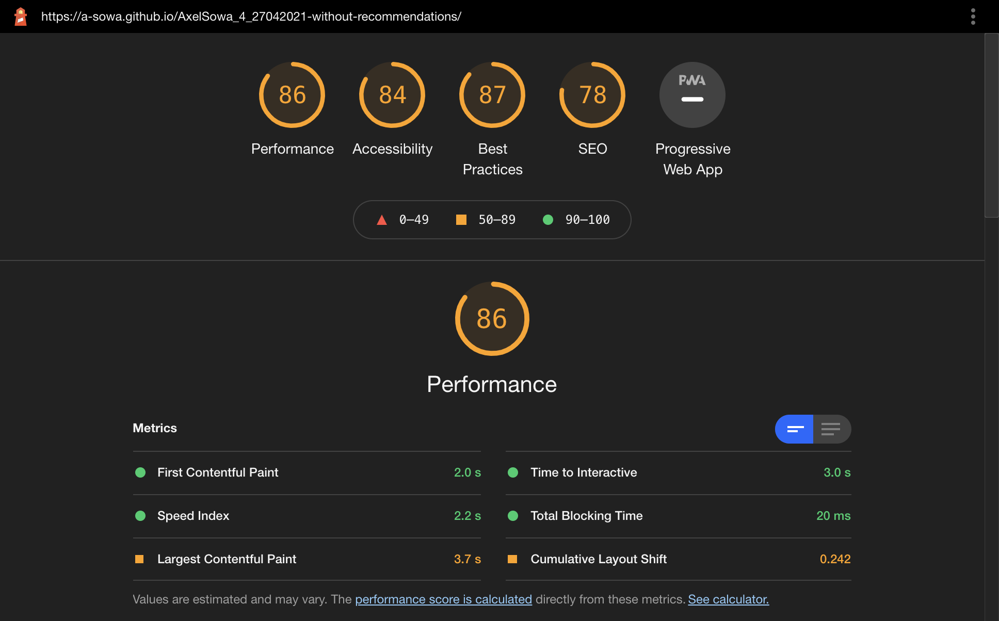
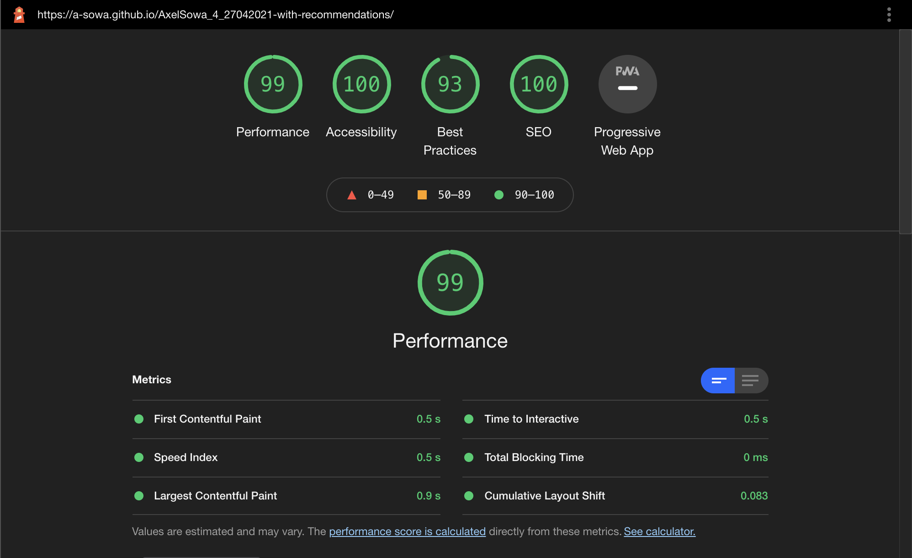

# 4th Project (P4) - OpenClassRooms Web Developer Training

This project is one of the 6 projects to be realized during the Web Developer training proposed by OpenClassRooms. 

Here are the instructions which were given : 
 
*"You work for La Chouette Agence, a web design agency based in Lyon. The company's activity started well but today, it is losing speed. Yes, the competition is tough. The founder of the company, Sophie, is looking for a solution to get the business going again. By typing "web design agency Lyon" on the Internet, she realizes that the agency's website only appears on the second page of search engines. Luckily, one of your colleagues, Martin, told her that you were a specialist in SEO."*

#### Here is the  [Initial Website](https://a-sowa.github.io/OCR-P4-without-recommendations/)

----
## 1 - SEO Audit and Report.

Select 10 recommendations to ehance the website SEO. **1 of them must be about speed and 1 of them must be about accessibility.**

### [Use this table for your recommendations](readme_rsrc/P4_01_analyse.pdf)

## 2 - Website Optimisation

Apply your recommendations to the website by **only using HTML & CSS**. Make sure that **is still responsive after your changes** and has **no errors in the HTML & CSS validator**. 

## 3 - Results Comparison

Write a report explaining your changes and showing the improvement of the site loading speed.
**Show it with performances analisis screenshots.**

---

#### [The report](https://docs.google.com/document/d/1Ud_d6flnjfbMgD-MbruEAGi6K_7ua-qb3fwVyNcP6xI/edit?usp=sharing)

### Performances Sceenshots : 

Initial Website : 

With my changes :

### Here is the  [Website with changes](https://a-sowa.github.io/OCR-P4-with-recommendations/)